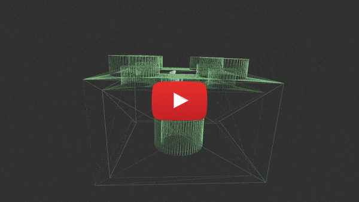

# MeshViewer

MeshViewer is an app written in C++ that allows you to view 3D models in STL format. I created it on [AMC Bridge](https://amcbridge.com.ua/)'s "Intensive Course on 3D Programming and Computer Graphics".

## Demo

## Technologies

- [glew](http://glew.sourceforge.net/)
- [glfw](https://www.glfw.org/)
- [glm](https://github.com/g-truc/glm)

## Keybindings

- <kbd>F1</kbd> front view
- <kbd>F2</kbd> right view
- <kbd>F3</kbd> rear view
- <kbd>F4</kbd> left view
- <kbd>F5</kbd> bottom view
- <kbd>F6</kbd> top view
- <kbd>F7</kbd> isometric view
- <kbd>F8</kbd> switch between orthographic and perspective projection
- <kbd>F9</kbd> draw only edges of triangles
- <kbd>F10</kbd> sets window width = screenWidth / 2 and height = screenHeight / 2
- <kbd>F11</kbd> full screen mode
- <kbd>Ctrl</kbd> + <kbd>O</kbd> opens a file selection window
- <kbd>Ctrl</kbd> + <kbd>D</kbd> duplicates selected 3D model
- <kbd>Left mouse click</kbd> on a 3D model selects it. The selected 3D model turns green
- <kbd>Scroll down</kbd> zoom in
- <kbd>Scroll up</kbd> zoom out
- To rotate camera press <kbd>right mouse button</kbd> and move pointer
- To rotate selected 3D model press <kbd>left mouse button</kbd> and move pointer
